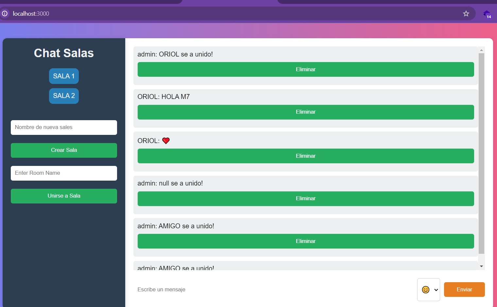

# Chat Moderno

Un chat en tiempo real con Node.js, Express, y Socket.io. Los usuarios pueden crear salas, unirse a otras, y comunicarse en tiempo real.

## Características

- Crear salas de chat personalizadas.
- El usuario que crea una sala se convierte en administrador.
- Los administradores pueden designar otros admins y eliminar mensajes.
- Los usuarios pueden unirse a múltiples salas a la vez.
- La aplicación mantiene el historial de mensajes para cada sala.

## Requisitos Previos

- Node.js (versión 14 o superior)
- npm (viene con Node.js)

## Aquí una captura de pantalla de nuestro chat en acción:



## Instalación

1. **Clona el Repositorio:**
   ```bash
   git clone https://github.com/y4assin/M5_CHAT_YASSINE.git
   ```

```bash
 cd public
 npm install
 node server.js
```
